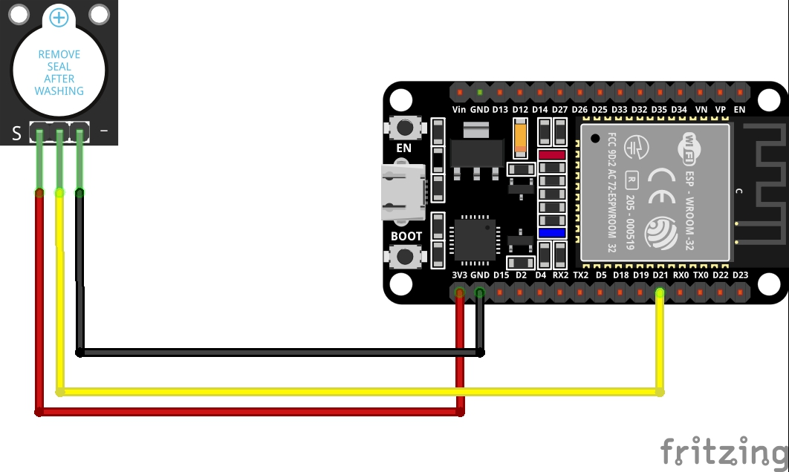

# 1. Practica Active Buzzer

## 1.1. Esquema


<br>

## 1.2. Material

* 3 x cables jumper
* 1 x Esp32
* 1 x Active Buzzer
## 1.2. Codigo
``` C++
#include <Arduino.h>

int buzzer = 21; // set the buzzer control digital IO pin
void setup()
{
  pinMode(buzzer, OUTPUT); // set pin 21 as output
}
void loop()
{
  for (int i = 0; i < 100; i++)
  {                             // make a sound
    digitalWrite(buzzer, HIGH); // send high signal to buzzer
    delay(1);                   // delay 1ms
    digitalWrite(buzzer, LOW);  // send low signal to buzzer
    delay(1);
  }
  delay(50);
  for (int j = 0; j < 100; j++)
  { // make another sound
    digitalWrite(buzzer, HIGH);
    delay(2); // delay 2ms
    digitalWrite(buzzer, LOW);
    delay(2);
  }
  delay(500);
}
```
