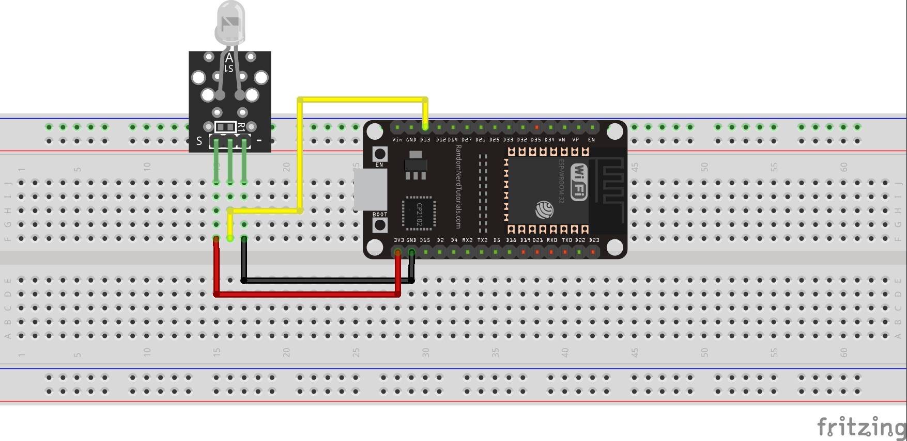

# 2. Practica Flash Color

## 2.1. Esquema


<br>

## 2.2. Codigo
``` C++
//Basic code enabling cycling of the module. 

int pin = 13; // select a digital pin for the LED
//===============================================================================
//  Initialization
//===============================================================================
void setup() 
{ 
  pinMode (pin, OUTPUT);
  Serial.begin (9600);      // Set output window comm rate
}
//===============================================================================
//  Main
//===============================================================================
void loop() 
{
  // Turn the LED on for 10 seconds and then off for 2
  Serial.println ("LED Turned ON");
  digitalWrite (pin, HIGH);
  delay(10000);

  Serial.println ("LED Turned OFF");
  digitalWrite (pin, LOW);
  delay(2000);
}
```
