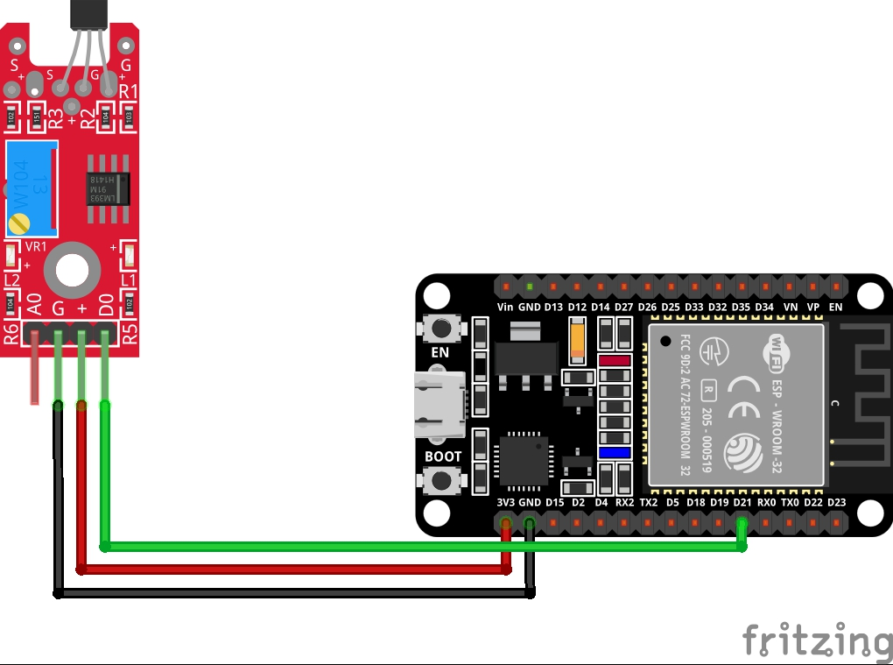

# 2. Linear Hall

## 2.1. Materiales


* 3 x cables jumper
* 1 x Esp32
* 1 x Linear Hall KY-024
  
## 2.2. Esquema


<br>

## 2.3. Codigo
``` C++
#include <Arduino.h>

// int analogPin = 18; // for Arduino microcontroller
//   int analogPin = A0; // for ESP8266 microcontroller
// int analogPin = A4; // for ESP32 microcontroller

// int digitalPin = 21; // for Arduino microcontroller
//   int digitalPin = D7; // for ESP8266 microcontroller
int digitalPin = 21; // for ESP32 microcontroller

void setup()
{
  pinMode(digitalPin, INPUT);
  Serial.begin(9600);
}

void loop()
{
  // int analogVal = analogRead(analogPin);
  int digitalVal = digitalRead(digitalPin);
  // Serial.print(analogVal);
  Serial.print("\t");
  Serial.println(digitalVal);
  delay(100);
}
```
