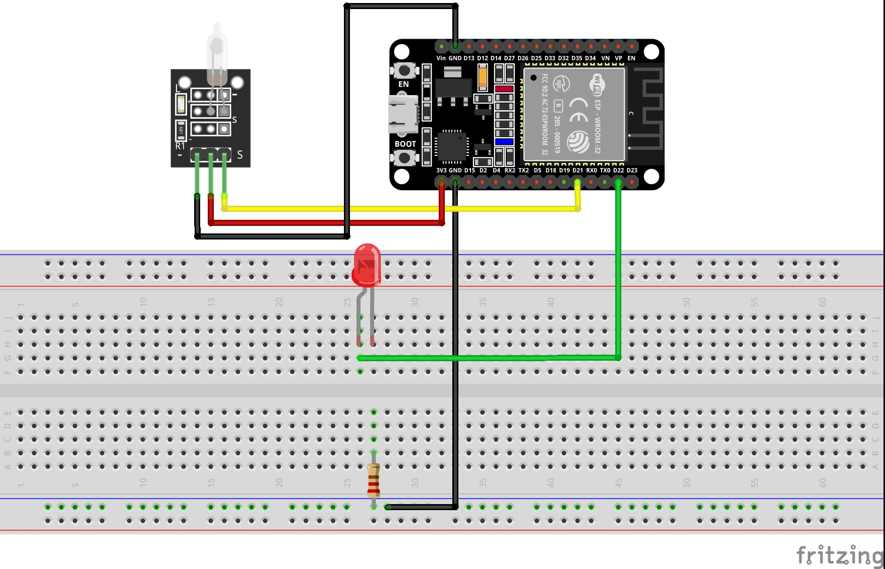

# 1. Practica Tilt Switch

## 1.1. Esquema


<br>

## 1.2. Codigo
```
int var;

void setup(){

pinMode (21,INPUT);
pinMode(22,OUTPUT);
}

void loop(){

 var = digitalRead(21);
 digitalWrite(22,var);
 }
```
