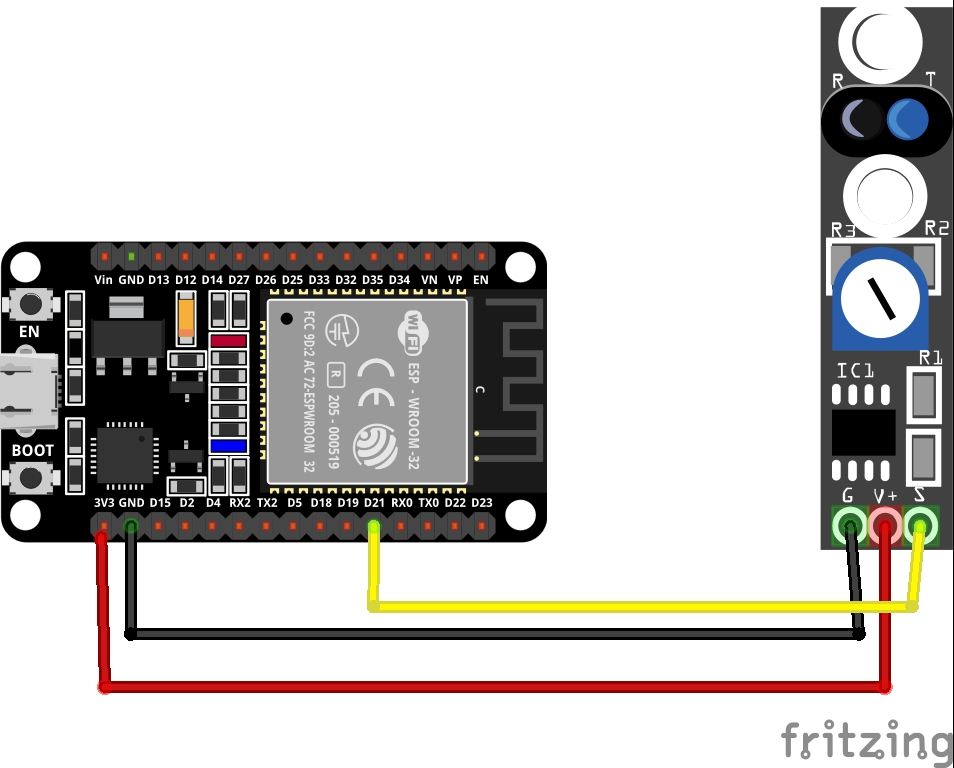

# 1. Practica Line Tracking

## 1.1. Esquema


<br>

## 1.2. Codigo
```
#include <Arduino.h>

void setup()
{
  Serial.begin(9600); // Iniciar el serial de m
}

void loop()
{
  Serial.println(digitalRead(21)); // Line Tracking sensor is connected with pin 21 of the Arduino
  delay(500);
}
```
