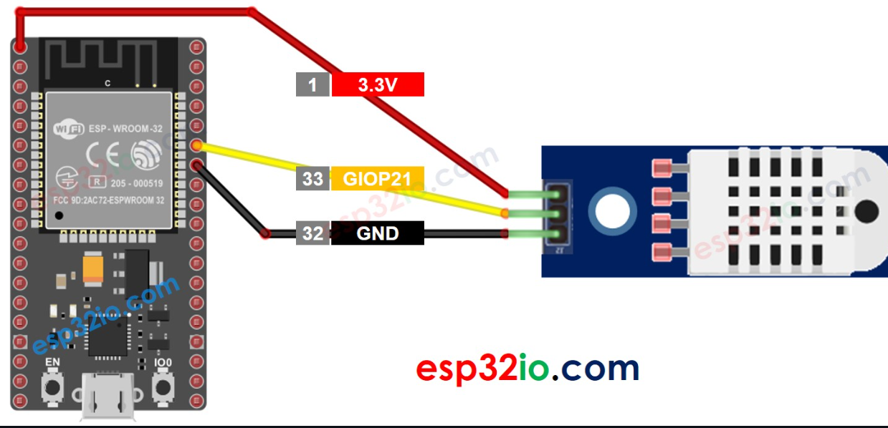

# 2. Practica Temperatura y humedad

## 2.1. Esquema



<br>

## 2.2. Codigo
<br>

``` C++
#include <DHT.h>
#define DHT_SENSOR_PIN  21 // ESP32 pin GIOP21 connected to DHT11 sensor
#define DHT_SENSOR_TYPE DHT11

DHT dht_sensor(DHT_SENSOR_PIN, DHT_SENSOR_TYPE);

void setup() {
  Serial.begin(9600);
  dht_sensor.begin(); // initialize the DHT sensor
}

void loop() {
  // read humidity
  float humi  = dht_sensor.readHumidity();
  // read temperature in Celsius
  float tempC = dht_sensor.readTemperature();
  // read temperature in Fahrenheit
  float tempF = dht_sensor.readTemperature(true);

  // check whether the reading is successful or not
  if ( isnan(tempC) || isnan(tempF) || isnan(humi)) {
    Serial.println("Failed to read from DHT sensor!");
  } else {
    Serial.print("Humidity: ");
    Serial.print(humi);
    Serial.print("%");

    Serial.print("  |  ");

    Serial.print("Temperature: ");
    Serial.print(tempC);
    Serial.print("°C  ~  ");
    Serial.print(tempF);
    Serial.println("°F");
  }

  // wait a 2 seconds between readings
  delay(2000);
}


```